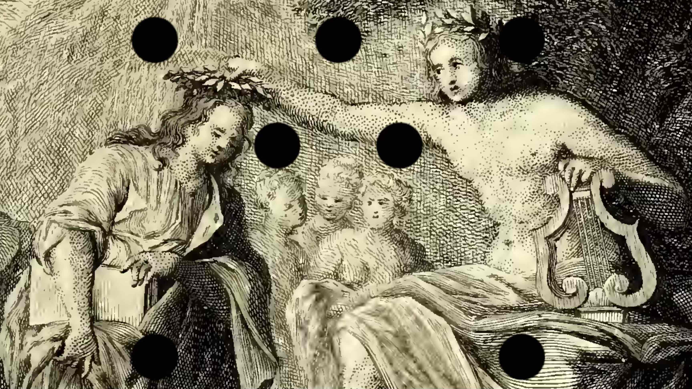

# Josephus

> [!IMPORTANT]  
> **Te, venerande Magiter, accedo, Musicae Praeceptis, ac Institutis imbuendus.**
>
> *I come to you, venerable master, in order to be introduced to the rules and principles of music.*

Josephus is a library of web components for music theory testing developed at Koninklijk Conservatorium Den Haag.

Josephus components can be used with your website to attach a music-theory-related quizes, exercises, exams or simple tasks.

## Some tools we used

- [StencilJS](https://stenciljs.com) for web component development.
- [Verovio](https://www.verovio.org/index.xhtml) for score rendering.
- [Music21j](https://tarmo.uuu.ee/varia/failid/komp/music21j/doc/index.html) for examples generation.
- [Tone.js](https://tonejs.github.io) for audio playback.

## Installation

TO DO.

## How it works

Exam -> Challenges -> Tasks -> Fields

## Components – quick presentation

### Test structure
- josephus-exam
- josephus-challenge
- josephus-task

### Utilities
- josephus-snippet
- josephus-timer
- josephus-audio

