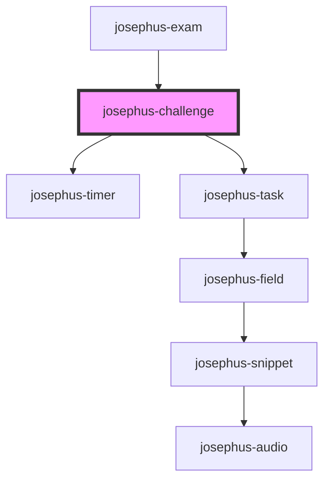

# josephus-challenge

<!-- Auto Generated Below -->

## Properties

| Property | Attribute | Description | Type                     | Default     |
| -------- | --------- | ----------- | ------------------------ | ----------- |
| `spec`   | --        |             | `{ tasks: TaskSpec[]; }` | `undefined` |

## Dependencies

### Used by

 - [josephus-exam](../josephus-exam)

### Depends on

- [josephus-timer](../josephus-timer)
- [josephus-task](../josephus-task)

### Graph

----------------------------------------------

*Built with [StencilJS](https://stenciljs.com/)*
