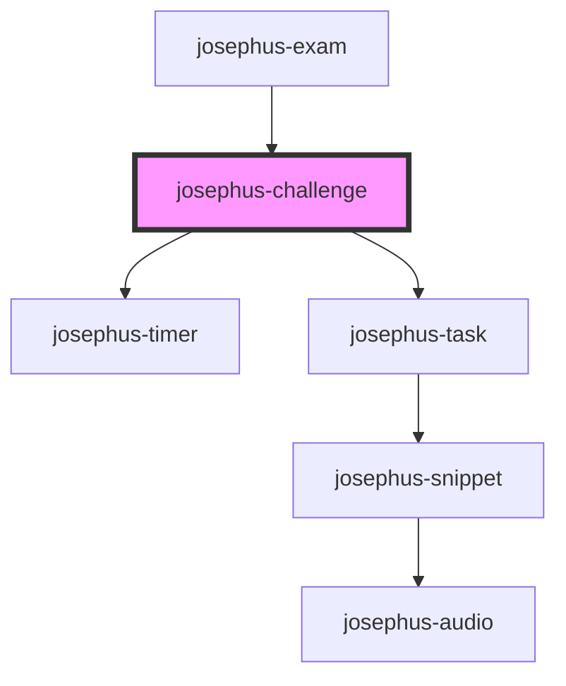

# josephus-challenge

<!-- Auto Generated Below -->

## Methods

### `load(spec: ChallengeSpec) => Promise<void>`

#### Parameters

| Name   | Type                     | Description |
| ------ | ------------------------ | ----------- |
| `spec` | `{ tasks: TaskSpec[]; }` |             |

#### Returns

Type: `Promise<void>`

## Dependencies

### Used by

 - [josephus-exam](../josephus-exam)

### Depends on

- [josephus-timer](../josephus-timer)
- [josephus-task](../josephus-task)

### Graph

----------------------------------------------

*Built with [StencilJS](https://stenciljs.com/)*
