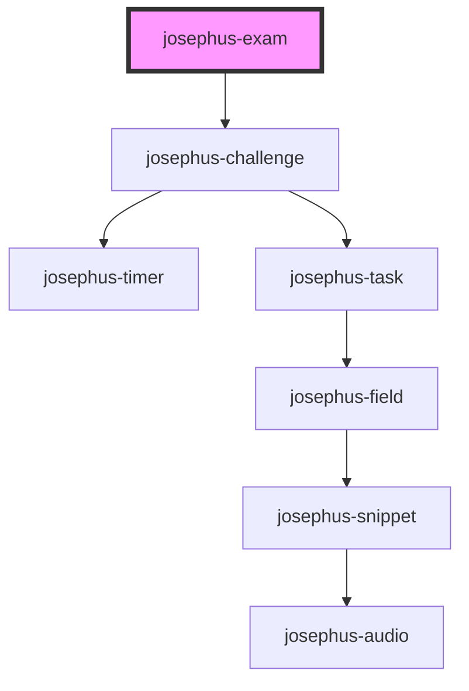

# josephus-exam

<!-- Auto Generated Below -->

## Properties

| Property | Attribute | Description | Type                                                                                                                                                             | Default     |
| -------- | --------- | ----------- | ---------------------------------------------------------------------------------------------------------------------------------------------------------------- | ----------- |
| `href`   | `href`    |             | `string`                                                                                                                                                         | `undefined` |
| `spec`   | --        |             | `` { $schema: string; title: string; instruction: string; categories: { [key: `#/categories/${string}`]: ChallengeCategory; }; challenges: ChallengeSpec[]; } `` | `undefined` |

## Shadow Parts

| Part                             | Description |
| -------------------------------- | ----------- |
| `"categories"`                   |             |
| `"category"`                     |             |
| `"category-description"`         |             |
| `"category-instruction"`         |             |
| `"category-list"`                |             |
| `"category-title"`               |             |
| `"challenge"`                    |             |
| `"challenge-button"`             |             |
| `"challenge-button-description"` |             |
| `"challenge-button-score"`       |             |
| `"challenge-button-title"`       |             |
| `"challenge-list"`               |             |
| `"exam"`                         |             |
| `"title"`                        |             |

## Dependencies

### Depends on

- [josephus-challenge](../josephus-challenge)

### Graph

```mermaid
graph TD;
  josephus-exam --> josephus-challenge
  josephus-challenge --> josephus-timer
  josephus-challenge --> josephus-task
  josephus-task --> josephus-field
  josephus-field --> josephus-snippet
  josephus-snippet --> josephus-audio
  style josephus-exam fill:#f9f,stroke:#333,stroke-width:4px
```

----------------------------------------------

*Built with [StencilJS](https://stenciljs.com/)*
