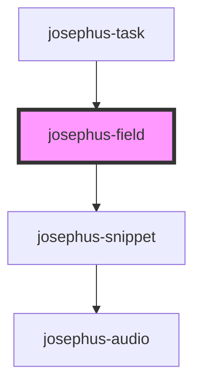

# josephus-field

<!-- Auto Generated Below -->

## Properties

| Property | Attribute | Description | Type                                                                                                                                                                                       | Default     |
| -------- | --------- | ----------- | ------------------------------------------------------------------------------------------------------------------------------------------------------------------------------------------ | ----------- |
| `scores` | --        |             | `StringMEI[][]`                                                                                                                                                                            | `[]`        |
| `spec`   | --        |             | `{ type: FieldType; scoreRefs: number[]; transforms: TransformSpec[]; repr: ScoreRepr[]; layout?: ScoreLayout; gui: JosephusGUI; items: number; events?: string[]; description: string; }` | `undefined` |

## Dependencies

### Used by

 - [josephus-task](../josephus-task)

### Depends on

- [josephus-snippet](../josephus-snippet)

### Graph

----------------------------------------------

*Built with [StencilJS](https://stenciljs.com/)*
