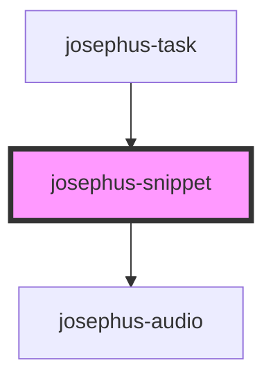

# josephus-snippet

<!-- Auto Generated Below -->

## Properties

| Property | Attribute | Description | Type          | Default                       |
| -------- | --------- | ----------- | ------------- | ----------------------------- |
| `data`   | `data`    |             | `string`      | `undefined`                   |
| `href`   | `href`    |             | `string`      | `undefined`                   |
| `repr`   | --        |             | `ScoreRepr[]` | `['label', 'audio', 'score']` |

## Dependencies

### Used by

 - [josephus-task](../josephus-task)

### Depends on

- [josephus-audio](../josephus-audio)

### Graph

----------------------------------------------

*Built with [StencilJS](https://stenciljs.com/)*
