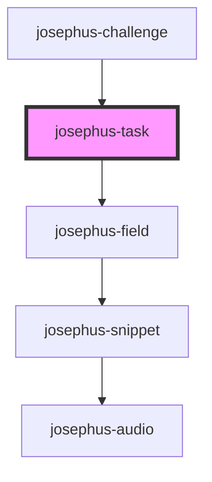

# josephus-task

<!-- Auto Generated Below -->

## Properties

| Property | Attribute | Description | Type                                            | Default     |
| -------- | --------- | ----------- | ----------------------------------------------- | ----------- |
| `count`  | `count`   |             | `number`                                        | `0`         |
| `spec`   | --        |             | `{ scores: ScoreSpec[]; fields: FieldSpec[]; }` | `undefined` |

## Events

| Event                   | Description | Type                                                |
| ----------------------- | ----------- | --------------------------------------------------- |
| `josephus-task-loading` |             | `CustomEvent<{ state: JosephusTaskLoadingState; }>` |

## Dependencies

### Used by

 - [josephus-challenge](../josephus-challenge)

### Depends on

- [josephus-field](../josephus-field)

### Graph

----------------------------------------------

*Built with [StencilJS](https://stenciljs.com/)*
