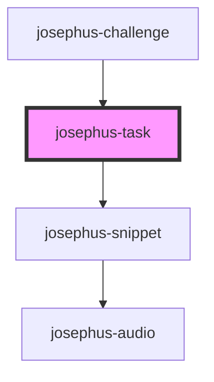

# josephus-task

<!-- Auto Generated Below -->

## Events

| Event                   | Description | Type                                                |
| ----------------------- | ----------- | --------------------------------------------------- |
| `josephus-task-loading` |             | `CustomEvent<{ state: JosephusTaskLoadingState; }>` |

## Methods

### `load(spec: TaskSpec) => Promise<void>`

#### Parameters

| Name   | Type                                            | Description |
| ------ | ----------------------------------------------- | ----------- |
| `spec` | `{ scores: ScoreSpec[]; fields: FieldSpec[]; }` |             |

#### Returns

Type: `Promise<void>`

## Dependencies

### Used by

 - [josephus-challenge](../josephus-challenge)

### Depends on

- [josephus-snippet](../josephus-snippet)

### Graph

----------------------------------------------

*Built with [StencilJS](https://stenciljs.com/)*
