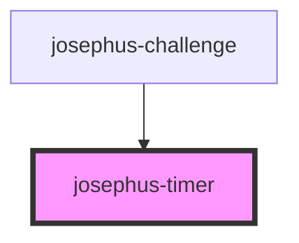

# josephus-timer

<!-- Auto Generated Below -->

## Properties

| Property      | Attribute      | Description | Type                                | Default                |
| ------------- | -------------- | ----------- | ----------------------------------- | ---------------------- |
| `danger`      | `danger`       |             | `number`                            | `this.debug ? 5 : 0`   |
| `debug`       | `debug`        |             | `boolean`                           | `true`                 |
| `overrun`     | `overrun`      |             | `number`                            | `this.debug ? 2 : 0`   |
| `overrunText` | `overrun-text` |             | `string`                            | `"Time's up!"`         |
| `paused`      | `paused`       |             | `boolean`                           | `false`                |
| `runs`        | `runs`         |             | `boolean`                           | `undefined`            |
| `secs`        | `secs`         |             | `number`                            | `this.debug ? 10 : 60` |
| `started`     | `started`      |             | `boolean`                           | `undefined`            |
| `state`       | `state`        |             | `"danger" \| "overrun" \| "warmup"` | `null`                 |
| `warmup`      | `warmup`       |             | `number`                            | `this.debug ? 3 : 0`   |

## Events

| Event                          | Description | Type                                          |
| ------------------------------ | ----------- | --------------------------------------------- |
| `josephus-timer-progress`      |             | `CustomEvent<any>`                            |
| `josephus-timer-state-changed` |             | `CustomEvent<{ state: JosephusTimerState; }>` |

## Dependencies

### Used by

 - [josephus-challenge](../josephus-challenge)

### Graph

----------------------------------------------

*Built with [StencilJS](https://stenciljs.com/)*
